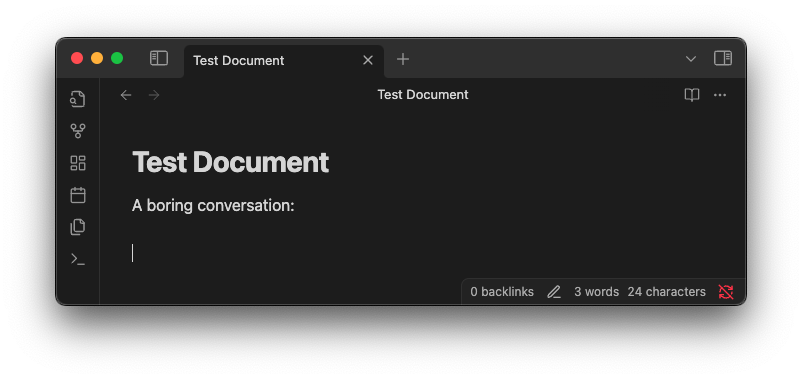
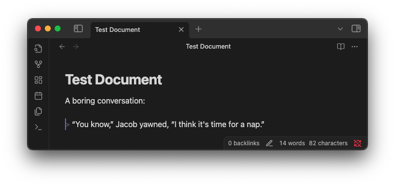
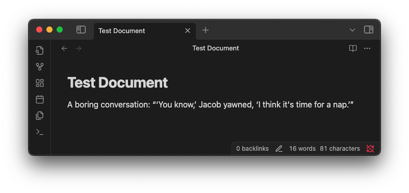
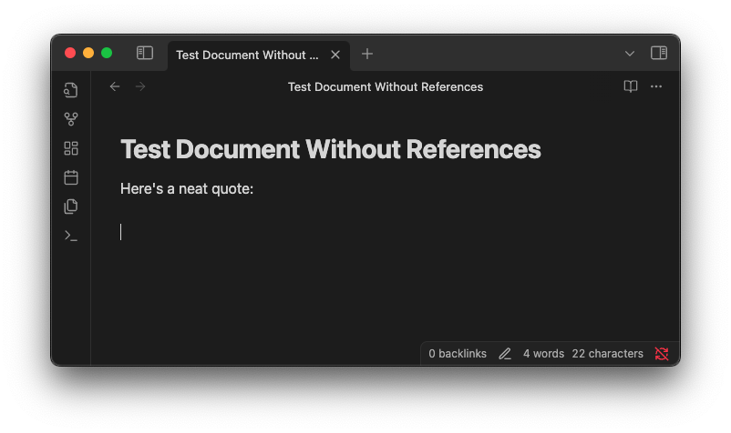
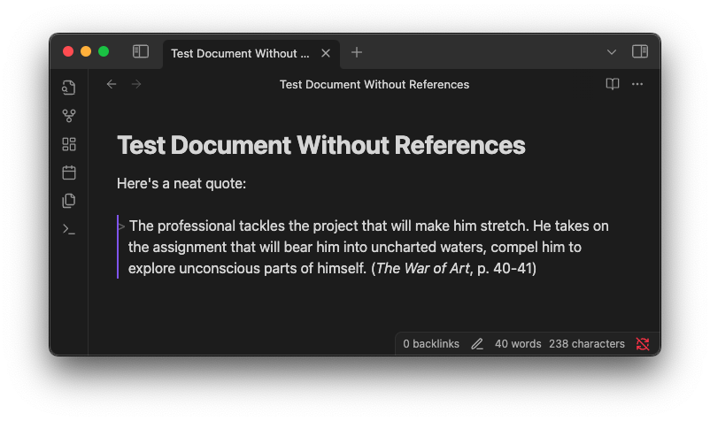
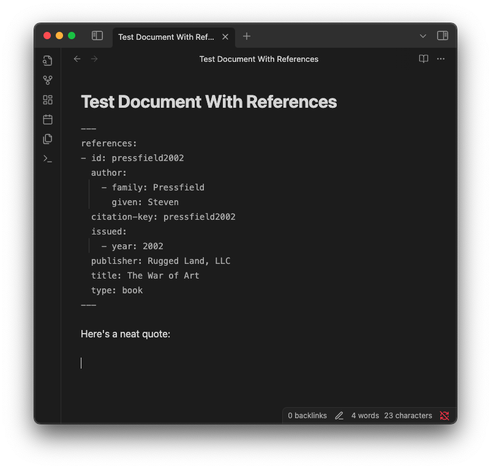

# "Paste Quote" Obsidian Plugin

This is a small [Obsidian](https://obsidian.md/) plugin to help with formatting and citing quotations when pasting them from the clipboard. Currently, citation support only applies to quotes pasted from the Kindle app, and is focused on generating [Pandoc-style citations](https://pandoc.org/chunkedhtml-demo/8.20-citation-syntax.html).

The plugin also contains a command to help paste references from e.g. Zotero into the `references` section of the note's front matter.

## Paste Quote command

### Formatting

Suppose you have this text on the clipboard:

```
“You know,” Jacob yawned, “I think it's time for a nap.”
```

If you use the `Paste quote` command while your cursor is at the _beginning_ of a line, this will be pasted as a block quote:





But if the cursor is in the middle of a line, then quotation marks will be added around the quote, and any internal double quotes are changed to single quotes, like this:




### Citations

If you copy text from the Kindle app, you'll end up with something like this on your clipboard:

```
The professional tackles the project that will make him stretch. He takes on the assignment that will bear him into uncharted waters, compel him to explore unconscious parts of himself.

Pressfield, Steven. The War of Art (pp. 40-41). (Function). Kindle Edition. 
```

The `Paste quote` command will change the citation format when pasting this. The new format depends on whether you have a `references` section in your note's front matter. If you _don't_ have a references section, then a simple title and page number format is used:





If your document _does_ have a references section in its frontmatter, then the plugin will try to find the correct reference for the quote based on the title, and generate a Pandoc-style citation using the corresponding `id`. Example:



![A sample document after pasting, which includes the quote and a citation in the format \[@pressfield2002, p. 40-41\]](docs/cite-refs-post.png)

## Paste CSL YAML command

Suppose you use [Zotero](https://www.zotero.org/) and [the Better BibTeX](https://retorque.re/zotero-better-bibtex/) plugin, and you select an entry there and use 'Copy as Better CSL YAML'. Then you'll have something like this on your clipboard:

```
---
references:
- id: pressfield2002
  author:
    - family: Pressfield
      given: Steven
  citation-key: pressfield2002
  issued:
    - year: 2002
  publisher: Rugged Land, LLC
  title: The War of Art
  type: book
...
```

Running the `Paste CSL YAML` command will add the references from the clipboard into your note's front matter. The advantage over just pasting it directly into the front matter yourself is that if your note _already_ has a `references` section in its front matter, the command will add the new references onto the existing list, and will warn you if there are any duplicate IDs.